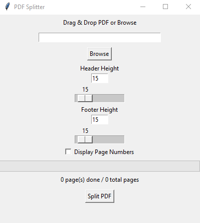
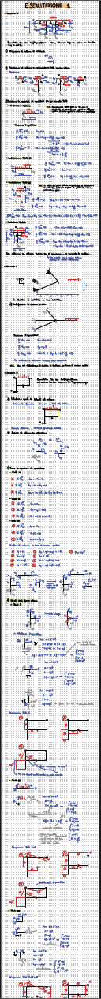
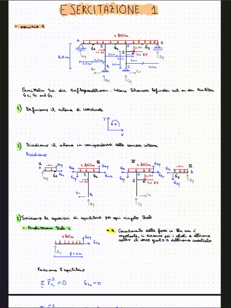

# rM_pdf_splitter

A Python utility to split continuous pages from reMarkable PDF exports into separate pages.

## Features

- Splits continuous pages.
- Maintains original quality.
- Simple (ugly) and lightweight interface.

## Simple (ugly) Interface

   

## Demo
<!-- 

  
  

 -->

<table align="center">
  <tr>
    <td align="center"><strong>Turn this:</strong></td>
    <td align="center"><strong>Into this:</strong></td>
  </tr>
  <tr>
    <td align="center"></td>
    <td align="center"></td>
  </tr>
</table>

## Automation with GitHub Actions

This project includes a GitHub Actions workflow to automatically bundle the Python code into an EXE file and upload it as a release.

## License

GPL License. See `LICENSE` for details.

