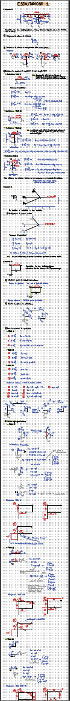

# rM_pdf_splitter

A Python utility to split continuous pages from reMarkable PDF exports into separate pages.

## Features

- Splits continuous pages.
- Maintains original quality.
- Simple (ugly) and lightweight interface.

## Simple (ugly) Interface
<p align="center">
   
</p>

## Demo
<!-- <p align="center" style="display: flex; justify-content: center; align-items: flex-start;">
  
  
</p>

<style>
  #img1 {
    height: auto;
    max-height: 100%;
  }
  #img2 {
    height: auto;
    max-height: 100vh; /* Prevents it from being too large */
  }
</style> -->

<table align="center">
  <tr>
    <td align="center"><strong>Turn this:</strong></td>
    <td align="center"><strong>Into this:</strong></td>
  </tr>
  <tr>
    <td align="center"></td>
    <td align="center"></td>
  </tr>
</table>

<script>
  window.onload = function() {
    let img1 = document.getElementById("img1");
    let img2 = document.getElementById("img2");

    img1.style.height = img2.clientHeight + "px"; // Match the GIF's height
    img1.style.width = "auto"; // Maintain aspect ratio
  };
</script>


## Automation with GitHub Actions

This project includes a GitHub Actions workflow to automatically bundle the Python code into an EXE file and upload it as a release.

### Template
The template use this formula to calculate the parameters
$$
\text{points} = \frac{\text{mm}*\text{DPI}}{25.4}
$$

## Template usage

Follow these steps to install a template on your reMarkable device:

1. SSH into the device (replace `rm2` with the host or user@ip if needed):

```bash
ssh rm2
```

2. Back up and edit the templates registry:

```bash
sudo cp /usr/share/remarkable/templates/templates.json ~/templates.json.backup
sudo nano /usr/share/remarkable/templates/templates.json
# Append the JSON entry for your template (see your local `template.json`)
```

3. Copy the template file to the device and place it in a custom templates folder:

```bash
sudo mkdir -p /usr/share/remarkable/templates/my_templates/
scp "path/to/LS Dotted S A4.template" rm2:/usr/share/remarkable/templates/my_templates/
```

4. Close any opened file and restart rm2 ui
```bash
systemctl restart xochitl
```

fast power shell command
```
scp "LS Dotted S A4.template" rm2:/usr/share/remarkable/templates/my_templates/; ssh rm2 "systemctl restart xochitl"
```

## License

GPL License. See `LICENSE` for details.

