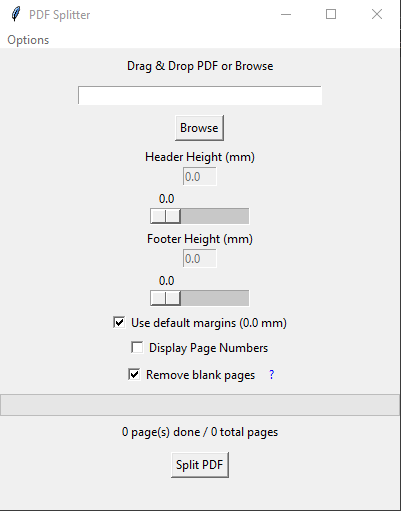
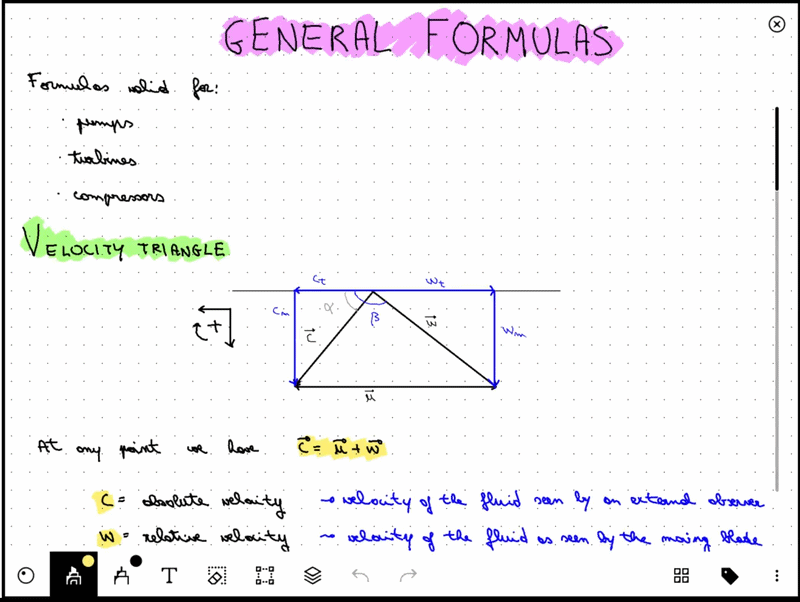
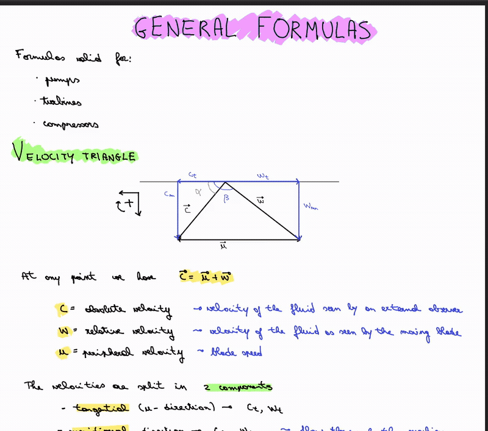
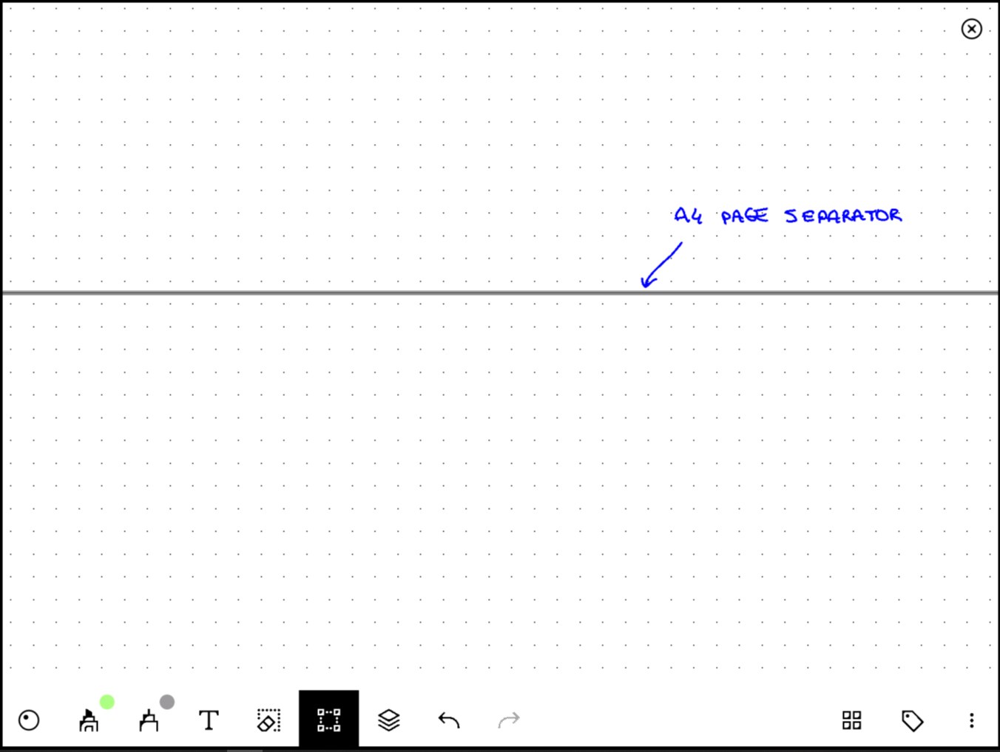

# rM_pdf_splitter

A Python utility to split continuous pages from reMarkable PDF exports into separate pages.

## Features

* Splits continuous long pages into multiple A4 pages.
* Maintains the original PDF quality.
* Detects and removes empty pages created during the splitting process.
* Includes a workflow to automatically push templates to the reMarkable device.

## Limitations

Currently developed and tested:

* On **reMarkable 2 (rM2)** only.
* For **A4 paper size** only.
* Currently developed and tested on **Windows only**. Support for macOS and Linux should be relatively easy to add, since the core codebase is written in Python. Contributions are welcome.

## Simple Interface

<p align="center">
   
</p>

## Usage

### Configure SSH access

First, configure your reMarkable device for SSH access by following this guide:

https://remarkable.guide/guide/access/ssh.html

### Push the template to your reMarkable

After configuring SSH, you can push the template to your device:

1. Open the application.
2. Open **Options**.
3. Select **`Push template to reMarkable...`**.
4. Fill in the required information:

   * **`IP / Hostname`** → Your reMarkable IP address or hostname (if configured).
   * **`user`** → It should be `root`.
   * **Password** or **SSH key file** → Use your password or SSH key if you configured SSH key authentication.

> **Note:** Pushing the template is required every time you update the reMarkable software.

### Recommendation

To avoid having to find the IP address of your reMarkable device every time:

* Reserve a fixed IP address for your reMarkable in your router settings.
* This ensures the device always receives the same IP address.

## Demo

<table align="center">
  <tr>
    <td align="center"><strong>Turn this:</strong></td>
    <td align="center"><strong>Into this:</strong></td>
  </tr>
  <tr>
    <td align="center"></td>
    <td align="center"></td>
  </tr>
</table>

## Contributing

To contribute:

1. Create a separate branch for your changes.
2. Make your modifications.
3. Verify that the project builds successfully by running:

```bash
pyinstaller pdf_splitter.spec
```
### Template

The template uses the following formula to calculate the required parameters:

$$
\text{points} = \frac{\text{mm} \times \text{DPI}}{25.4}
$$
<p align="center">
   
</p>


## Troubleshooting

If you encounter problems, check the application logs:

```
C:\Users\<you>\AppData\Roaming\rM_pdf_splitter\logs
```

## Support

I built this tool to solve a personal problem: making it easier to print and organize my engineering notes created on the reMarkable.

After using it myself, I decided it was mature enough to share with everyone, especially students who may find it useful for their studies.

I know that students are often on a tight budget, so the tool will always remain free and open source.

If you find it useful and would like to support the project, you can:

* Buy me a coffee ☕ or sponsor the project on GitHub
* Contribute code, documentation, testing, or bug reports

Any kind of support is appreciated and helps me continue improving the project.


## License

GPL-3 License. See `LICENSE` for details.
